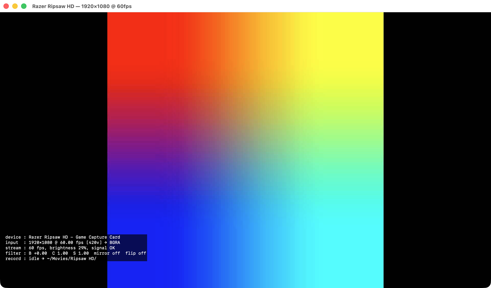

# Ripsaw HD Viewer

A native macOS viewer and recorder for the **Razer Ripsaw HD** game capture card.
No driver required — one Swift file, no dependencies.



## Why no driver?

The Ripsaw HD is a class-compliant USB device, so macOS's built-in drivers
already handle everything it exposes:

- **Video** — enumerates as a UVC camera ("Razer Ripsaw HD - Game Capture Card",
  vendor `0x1532`, product `0x0D01`), up to 1080p60.
- **Audio** — three USB Audio Class endpoints: HDMI audio in (stereo, 48 kHz),
  mic passthrough in (mono), and headphone out (stereo).

It already works as a source in OBS, QuickTime, or Zoom. What macOS lacks is
Razer's Synapse capture app — this project fills that gap.

## Install

Download `Ripsaw-HD-Viewer-<version>.dmg` from
[Releases](../../releases), open it, and drag **Ripsaw HD Viewer** to
Applications.

The app is ad-hoc signed (no Apple Developer certificate), so Gatekeeper will
block the first launch of a downloaded copy. Either right-click the app →
Open → Open, or clear the quarantine flag:

```sh
xattr -dr com.apple.quarantine "/Applications/Ripsaw HD Viewer.app"
```

Allow Camera and Microphone access when prompted.

### Build from source

```sh
./build.sh
open "build/Ripsaw HD Viewer.app"
```

Requires Xcode command-line tools (`swiftc`); no other dependencies.

## Features

- **Live preview** at the card's best format (1080p60), with captured HDMI
  audio monitored through your default output device.
- **Control rail** — move the mouse to the bottom of the window or click
  anywhere on the video; fades out after a couple of seconds.
- **Recording** (`⌘R` or the ● button) — H.264 + AAC `.mov`, revealed in
  Finder when you stop. Default location `~/Movies/Ripsaw HD/`; change it via
  File → Set Recording Folder….
- **Recording size** — Native, 1080p, 720p, or 480p, scaled at encode time
  independent of the input format.
- **Input format picker** — switch between the modes the card advertises.
- **Brightness / Contrast / Saturation sliders** and **Mirror / Flip**
  toggles — applied live to both the preview and recordings.
- **Debug overlay** (`⌘D`) — device, input format, measured fps, signal
  health, filter values, and recording stats.
- **Self-healing capture** — if the card drops off USB, the session errors,
  or frames stop for 5 seconds, the app reconfigures automatically and keeps
  retrying until the card returns.
- **Signal-drop blanking** — when frames stop, the display goes black with a
  "NO SIGNAL" watermark within ~0.75 s instead of freezing on the last frame.

## Troubleshooting

- **Black video (no watermark) at 60 fps** — the card is delivering a black
  picture: usually HDCP-protected content (streaming apps, cable boxes) or a
  sleeping source. Game/desktop output is fine.
- **"waiting for capture card…" in the title** — the Ripsaw isn't enumerating
  on USB; check the USB-C cable. The app reconnects automatically.
- **Diagnostics** — the app writes one status line per second to
  `build/diag.log` (or next to the app if built elsewhere).

## License

MIT — see [LICENSE](LICENSE).

Not affiliated with Razer Inc. "Razer" and "Ripsaw" are trademarks of
Razer Inc., used here only to identify the hardware this tool works with.
